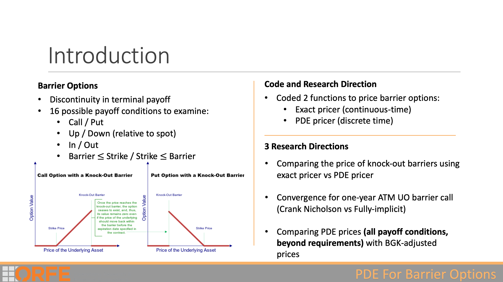
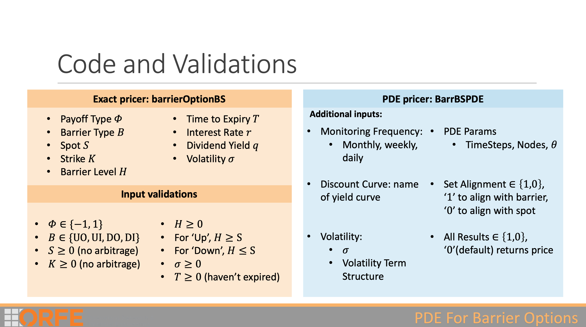
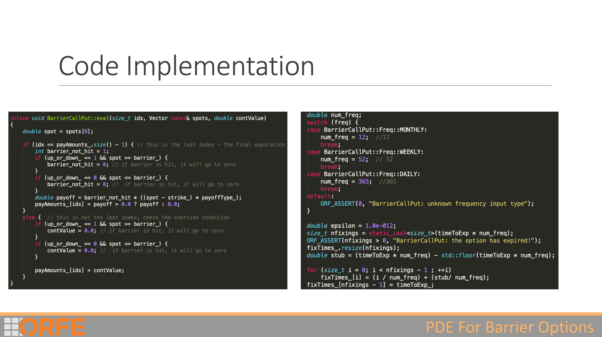
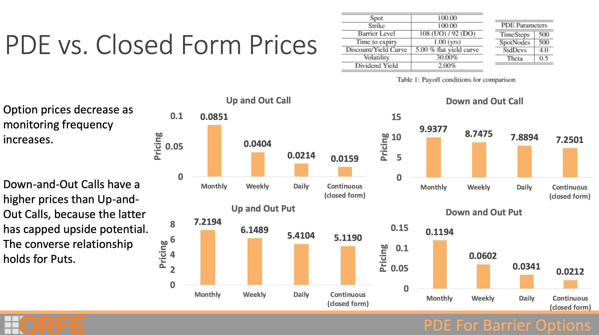
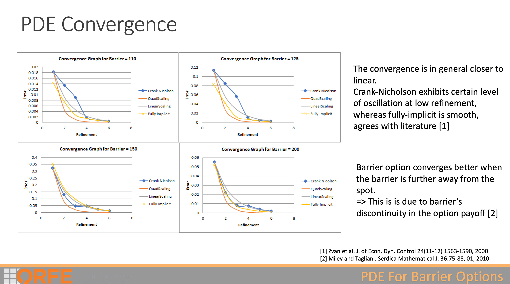
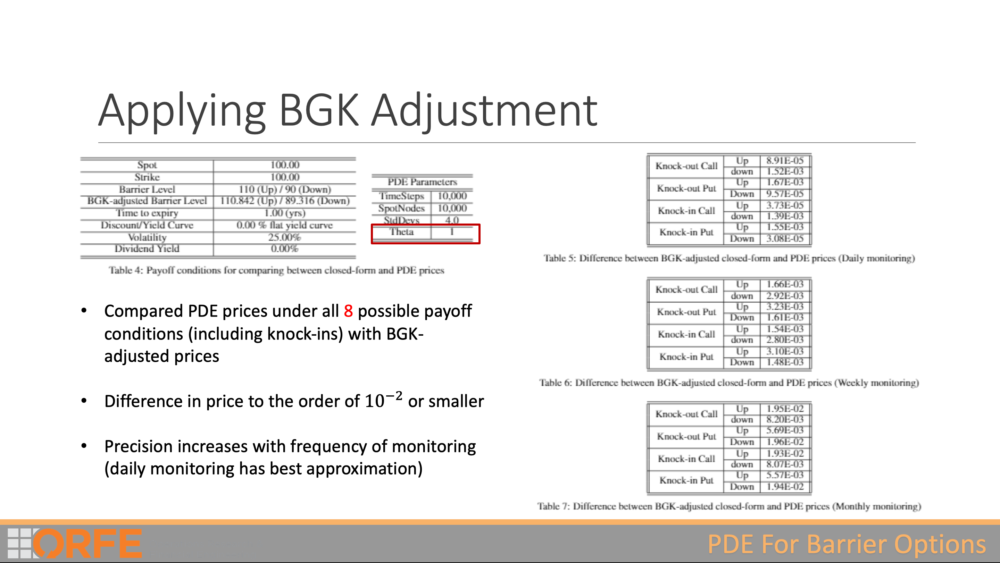
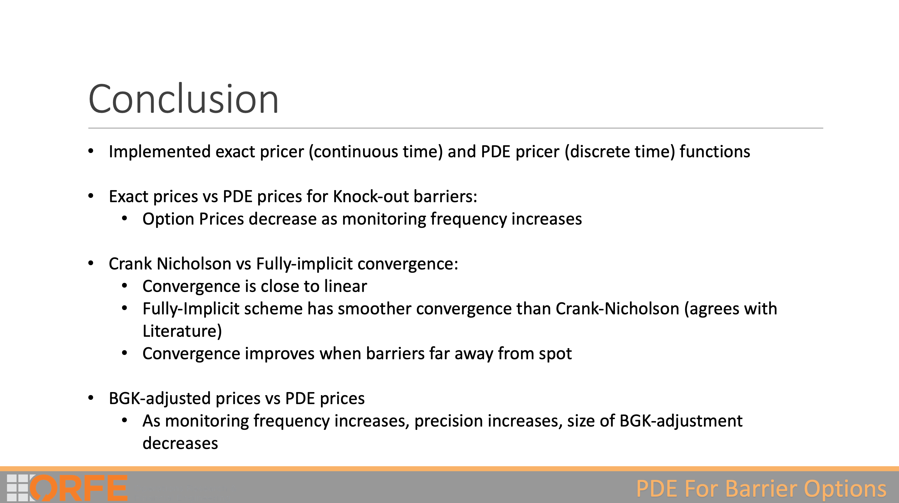

# Pricing Barrier Options

Authors: John Cai, Aarsh Sachdeva, Xiaoyu Liu, Kuishuai Yi

Pricing Barrier Options using PDEs in C++.

## Introduction and GGuide

This was part of our project where we extended a C++ library to price barrier options using PDES. I was the lead developer for this project.

To compile this file, you will need the relevant C++ libraies. You can email me at johncai117@gmail.com to ask for it. You will also need the Armadillo C++ Scientific library.

To just use it to price a barrier option, you can simply load the XLL SUBMISSION.xll file.

For more explanation on the use, check out the explanation below.

## Explanation of Results

